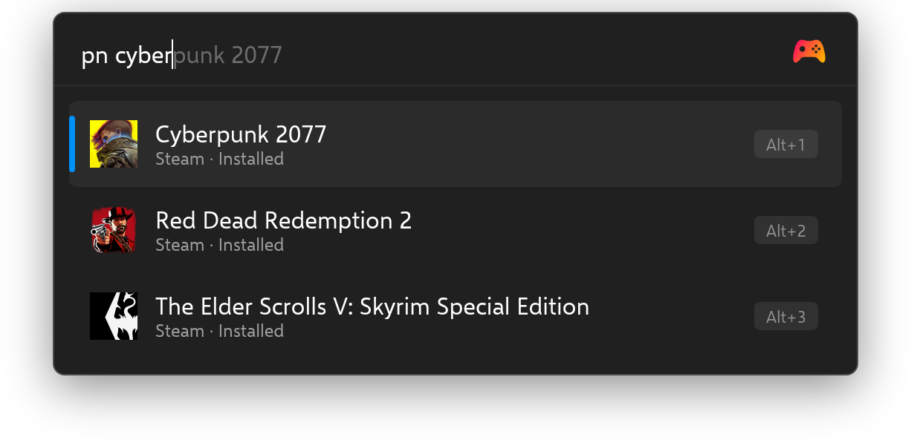
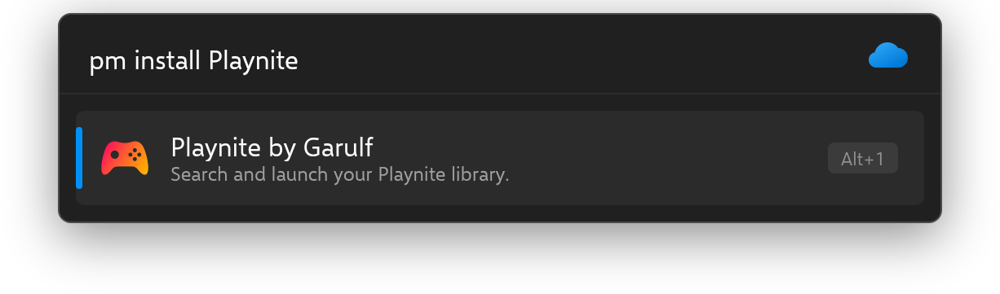

<!-- generated by readwright from docs/README.md.j2; edit the template, not this file -->
# Playnite

Search and launch your Playnite library. Fully local, no Playnite extension required.

[](https://github.com/Garulf/Playnite-Plugin/actions/workflows/tests.yml) [](https://github.com/Garulf/Playnite-Plugin/releases/latest) [](https://github.com/Garulf/Playnite-Plugin/blob/main/LICENSE)

[](https://www.buymeacoffee.com/garulf) [](https://github.com/sponsors/Garulf)

## Features

* **No Playnite extension required.** Reads `games.db` directly with litedb-py.
* **Fully local.** No web requests, no API keys.
* **Fuzzy matching.** `pn rdr2` will match Red Dead Redemption 2.
* **Icons and cover art.** Game icons in results, cover art on `F1`.
* **All your sources.** Every library Playnite knows about, in one search.
* **Launch or open.** Installed games launch directly; uninstalled games open their Playnite page.
* **Rich context menu.** Open install folder, jump to store links, copy the game id.
* **Hidden games, opt-in.** Include games hidden in Playnite via a setting.

## Usage

Type `pn` followed by a game name:

```
pn cyber
```



## Installation

### Flow Launcher

In Flow Launcher, type:

```
pm install playnite
```



### Manual installation

Download `Playnite-Plugin-<version>.zip` from the [latest release](https://github.com/Garulf/Playnite-Plugin/releases/latest) and unzip it into
`%appdata%\FlowLauncher\Plugins`, then restart Flow Launcher.

## Changelog

See [CHANGELOG.md](CHANGELOG.md) for the full history.
